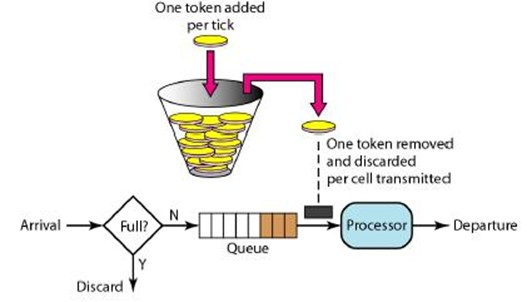

## 网关 rate limit 网络速率限制方案

### 一、网络限流算法
~~~
    在计算机领域中，限流技术（time limiting）被用来控制网络接口收发通讯数据的速率。用这个方法来优化性能、较少延迟和提高带宽等。
    在互联网领域中也借鉴了这个概念，用来控制网络请求的速率，在高并发，大流量的场景中，比如双十一秒杀、抢购、抢票、抢单等场景。
    网络限流主流的算法有两种，分别是漏桶算法和令牌桶算法。接下来我们一一为大家介绍：
~~~
#### 1. 漏桶算法
  

描述：漏桶算法思路很简单，水（数据或者请求）先进入到漏桶里，漏桶以一定的速度出水，当水流入速度过大会直接溢出，可以看出漏桶算法能强行限制数据的传输速率。

> 实现逻辑： 控制数据注入到网络的速率，平滑网络上的突发流量。漏桶算法提供了一种机制，通过它，突发流量可以被整形以便为网络提供一个稳定的流量。 漏桶可以看作是一个带有常量服务时间的单服务器队列，如果漏桶（包缓存）溢出，那么数据包会被丢弃。  

> 优缺点：在某些情况下，漏桶算法不能够有效地使用网络资源。因为漏桶的漏出速率是固定的参数，所以，即使网络中不存在资源冲突（没有发生拥塞），漏桶算法也不能使某一个单独的流突发到端口速率。因此，漏桶算法对于存在突发特性的流量来说缺乏效率。而令牌桶算法则能够满足这些具有突发特性的流量。通常，漏桶算法与令牌桶算法可以结合起来为网络流量提供更大的控制。

#### 2. 令牌桶算法


> 实现逻辑：令牌桶算法的原理是系统会以一个恒定的速度往桶里放入令牌，而如果请求需要被处理，则需要先从桶里获取一个令牌，当桶里没有令牌可取时，则拒绝服务。 令牌桶的另外一个好处是可以方便的改变速度。 一旦需要提高速率，则按需提高放入桶中的令牌的速率。 一般会定时(比如100毫秒)往桶中增加一定数量的令牌， 有些变种算法则实时的计算应该增加的令牌的数量, 比如华为的专利"采用令牌漏桶进行报文限流的方法"(CN 1536815 A),提供了一种动态计算可用令牌数的方法， 相比其它定时增加令牌的方法， 它只在收到一个报文后，计算该报文与前一报文到来的时间间隔内向令牌漏桶内注入的令牌数， 并计算判断桶内的令牌数是否满足传送该报文的要求。


### 二、常见的 Rate limiting 实现方式
**通常意义上的限速，其实可以分为以下三种：**
+ limit_rate 限制响应速度
+ limit_conn 限制连接数
+ limit_req 限制请求数

#### 1. Nginx 模块 (漏桶)
* 参考地址：[limit_req_module](http://nginx.org/en/docs/http/ngx_http_limit_req_module.html)

> ngx_http_limit_req_module模块(0.7.21)用于限制每个定义键的请求处理速度，特别是来自单个IP地址的请求的处理速度。

##### 1.1 Example Configuration
```nginx
http {
    limit_req_zone $binary_remote_addr zone=one:10m rate=1r/s;

    ...

    server {

        ...

        location /search/ {
            limit_req zone=one burst=5;
        }
```
##### 1.2 使用规则
```nginx
语法:	limit_req zone=name [burst=number] [nodelay | delay=number];
默认:	—
作用范围:	http, server, location
```
**参数说明**
* zone 设置内存名称和内存大小。
* burst 漏桶的突发大小。当大于突发值是请求被延迟。
* nodelay|delay delay参数(1.15.7)指定了过度请求延迟的限制。默认值为零，即所有过量的请求都被延迟。

> 设置共享内存区域和请求的最大突发大小。如果请求速率超过为区域配置的速率，则延迟处理请求，以便以定义的速率处理请求。过多的请求会被延迟，直到它们的数量超过最大突发大小，在这种情况下，请求会因错误而终止。默认情况下，最大突发大小等于零。
```nginx
limit_req_zone $binary_remote_addr zone=one:10m rate=1r/s;

server {
    location /search/ {
        limit_req zone=one burst=5;
    }
```
描述：平均每秒不允许超过一个请求，突发请求不超过5个。

**-----参数使用说明-----**  

1. 如果不希望在请求受到限制时延迟过多的请求，则应使用参数nodelay:
```nginx
limit_req zone=one burst=5 nodelay;
```
2. 可以有几个limit_req指令。例如，下面的配置将限制来自单个IP地址的请求的处理速度，同时限制虚拟服务器的请求处理速度:
```nginx
limit_req_zone $binary_remote_addr zone=perip:10m rate=1r/s;
limit_req_zone $server_name zone=perserver:10m rate=10r/s;

server {
    ...
    limit_req zone=perip burst=5 nodelay;
    limit_req zone=perserver burst=10;
}
```
> 当且仅当当前级别上没有limit_req指令时，这些指令从上一级继承。
##### 1.3 围绕limit_req_zone的相关配置
---
```nginx
语法:	limit_req_log_level info | notice | warn | error;
默认:	limit_req_log_level error;
作用范围:	http, server, location
```
This directive appeared in version 0.8.18.
> 设置所需的日志记录级别，用于服务器因速率超过或延迟请求处理而拒绝处理请求的情况。延迟日志记录级别比拒绝日志记录级别低1点;例如，如果指定了“limit_req_log_level通知”，则使用info级别记录延迟。
---
<a name="limit_req_status">错误状态</a>
```nginx
语法:	limit_req_status code;
默认:	limit_req_status 503;
作用范围:	http, server, location
```
This directive appeared in version 1.3.15.
> 设置状态代码以响应被拒绝的请求。
---
```nginx
语法:	limit_req_zone key zone=name:size rate=rate [sync];
默认:	—
作用范围:	http
```
> 设置共享内存区域的参数，该区域将保存各种键的状态。特别是，状态存储当前过多请求的数量。键可以包含文本、变量及其组合。键值为空的请求不被计算。

Prior to version 1.7.6, a key could contain exactly one variable.
例如：
```nginx
limit_req_zone $binary_remote_addr zone=one:10m rate=1r/s;
```
说明：在这里，状态保存在一个10mb的区域“1”中，该区域的平均请求处理速度不能超过每秒1个请求。

--- 
##### 总结：
1. 客户端IP地址作为密钥。注意，这里使用的是$binary_remote_addr变量，而不是$remote_addr。$binary_remote_addr变量的大小对于IPv4地址总是4个字节，对于IPv6地址总是16个字节。存储状态在32位平台上总是占用64字节，在64位平台上占用128字节。一个兆字节区域可以保存大约16000个64字节的状态，或者大约8000个128字节的状态。
2. 如果区域存储耗尽，则删除最近最少使用的状态。即使在此之后无法创建新状态，请求也会因<a href="#limit_req_status">错误</a>而终止。
3. 速率以每秒请求数(r/s)指定。如果需要每秒少于一个请求的速率，则在每分钟请求(r/m)中指定。例如，每秒半请求是30r/m。

#### 2. Openresty 模块
* 参考地址：[lua-resty-limit-traffic](https://github.com/openresty/lua-resty-limit-traffic)
* 参考地址：[openresty常用限速](https://blog.csdn.net/cn_yaojin/article/details/81774380)

##### 2.1 限制接口总并发数
> 按照 ip 限制其并发连接数
```lua
lua_shared_dict my_limit_conn_store 100m;
...
location /hello {
   access_by_lua_block {
       local limit_conn = require "resty.limit.conn"
       -- 限制一个 ip 客户端最大 1 个并发请求
       -- burst 设置为 0，如果超过最大的并发请求数，则直接返回503，
       -- 如果此处要允许突增的并发数，可以修改 burst 的值（漏桶的桶容量）
       -- 最后一个参数其实是你要预估这些并发（或者说单个请求）要处理多久，以便于对桶里面的请求应用漏桶算法
       
       local lim, err = limit_conn.new("my_limit_conn_store", 1, 0, 0.5)              
       if not lim then
           ngx.log(ngx.ERR, "failed to instantiate a resty.limit.conn object: ", err)
           return ngx.exit(500)
       end

       local key = ngx.var.binary_remote_addr
       -- commit 为true 代表要更新shared dict中key的值，
       -- false 代表只是查看当前请求要处理的延时情况和前面还未被处理的请求数
       local delay, err = lim:incoming(key, true)
       if not delay then
           if err == "rejected" then
               return ngx.exit(503)
           end
           ngx.log(ngx.ERR, "failed to limit req: ", err)
           return ngx.exit(500)
       end

       -- 如果请求连接计数等信息被加到shared dict中，则在ctx中记录下，
       -- 因为后面要告知连接断开，以处理其他连接
       if lim:is_committed() then
           local ctx = ngx.ctx
           ctx.limit_conn = lim
           ctx.limit_conn_key = key
           ctx.limit_conn_delay = delay
       end

       local conn = err
       -- 其实这里的 delay 肯定是上面说的并发处理时间的整数倍，
       -- 举个例子，每秒处理100并发，桶容量200个，当时同时来500个并发，则200个拒掉
       -- 100个在被处理，然后200个进入桶中暂存，被暂存的这200个连接中，0-100个连接其实应该延后0.5秒处理，
       -- 101-200个则应该延后0.5*2=1秒处理（0.5是上面预估的并发处理时间）
       if delay >= 0.001 then
           ngx.sleep(delay)
       end
   }

   log_by_lua_block {
       local ctx = ngx.ctx
       local lim = ctx.limit_conn
       if lim then
           local key = ctx.limit_conn_key
           -- 这个连接处理完后应该告知一下，更新shared dict中的值，让后续连接可以接入进来处理
           -- 此处可以动态更新你之前的预估时间，但是别忘了把limit_conn.new这个方法抽出去写，
           -- 要不每次请求进来又会重置
           local conn, err = lim:leaving(key, 0.5)
           if not conn then
               ngx.log(ngx.ERR,
                       "failed to record the connection leaving ",
                       "request: ", err)
               return
           end
       end
   }
   proxy_pass http://10.100.157.198:6112;
   proxy_set_header Host $host;
   proxy_redirect off;
   proxy_set_header X-Real-IP $remote_addr;
   proxy_set_header X-Forwarded-For $proxy_add_x_forwarded_for;
   proxy_connect_timeout 60;
   proxy_read_timeout 600;
   proxy_send_timeout 600;
}
```
说明：其实此处没有设置 burst 的值，就是单纯的限制最大并发数，如果设置了 burst 的值，并且做了延时处理，其实就是对并发数使用了漏桶算法，但是如果不做延时处理，其实就是使用的令牌桶算法。参考下面对请求数使用漏桶令牌桶的部分，并发数的漏桶令牌桶实现与之相似

##### 2.2 限制接口时间窗请求数
> 限制 ip 每分钟只能调用 120 次 /hello 接口（允许在时间段开始的时候一次性放过120个请求）
```lua
lua_shared_dict my_limit_count_store 100m;
...

init_by_lua_block {
   require "resty.core"
}
....

location /hello {
   access_by_lua_block {
       local limit_count = require "resty.limit.count"

       -- rate: 10/min 
       local lim, err = limit_count.new("my_limit_count_store", 120, 60)
       if not lim then
           ngx.log(ngx.ERR, "failed to instantiate a resty.limit.count object: ", err)
           return ngx.exit(500)
       end

       local key = ngx.var.binary_remote_addr
       local delay, err = lim:incoming(key, true)
       -- 如果请求数在限制范围内，则当前请求被处理的延迟（这种场景下始终为0，因为要么被处理要么被拒绝）和将被处理的请求的剩余数
       if not delay then
           if err == "rejected" then
               return ngx.exit(503)
           end

           ngx.log(ngx.ERR, "failed to limit count: ", err)
           return ngx.exit(500)
       end
   }

   proxy_pass http://10.100.157.198:6112;
   proxy_set_header Host $host;
   proxy_redirect off;
   proxy_set_header X-Real-IP $remote_addr;
   proxy_set_header X-Forwarded-For $proxy_add_x_forwarded_for;
   proxy_connect_timeout 60;
   proxy_read_timeout 600;
   proxy_send_timeout 600;
}
```
##### 2.3 平滑限制接口请求数
> 限制 ip 每分钟只能调用 120 次 /hello 接口（平滑处理请求，即每秒放过2个请求）
```lua
lua_shared_dict my_limit_req_store 100m;
....

location /hello {
   access_by_lua_block {
       local limit_req = require "resty.limit.req"
       -- 这里设置rate=2/s，漏桶桶容量设置为0，（也就是来多少水就留多少水） 
       -- 因为resty.limit.req代码中控制粒度为毫秒级别，所以可以做到毫秒级别的平滑处理
       local lim, err = limit_req.new("my_limit_req_store", 2, 0)
       if not lim then
           ngx.log(ngx.ERR, "failed to instantiate a resty.limit.req object: ", err)
           return ngx.exit(500)
       end

       local key = ngx.var.binary_remote_addr
       local delay, err = lim:incoming(key, true)
       if not delay then
           if err == "rejected" then
               return ngx.exit(503)
           end
           ngx.log(ngx.ERR, "failed to limit req: ", err)
           return ngx.exit(500)
       end
   }

   proxy_pass http://10.100.157.198:6112;
   proxy_set_header Host $host;
   proxy_redirect off;
   proxy_set_header X-Real-IP $remote_addr;
   proxy_set_header X-Forwarded-For $proxy_add_x_forwarded_for;
   proxy_connect_timeout 60;
   proxy_read_timeout 600;
   proxy_send_timeout 600;
}
```
##### 2.4 漏桶算法限流
> 限制 ip 每分钟只能调用 120 次 /hello 接口（平滑处理请求，即每秒放过2个请求），超过部分进入桶中等待，（桶容量为60），如果桶也满了，则进行限流
```lua
lua_shared_dict my_limit_req_store 100m;
....

location /hello {
   access_by_lua_block {
       local limit_req = require "resty.limit.req"
       -- 这里设置rate=2/s，漏桶桶容量设置为0，（也就是来多少水就留多少水） 
       -- 因为resty.limit.req代码中控制粒度为毫秒级别，所以可以做到毫秒级别的平滑处理
       local lim, err = limit_req.new("my_limit_req_store", 2, 60)
       if not lim then
           ngx.log(ngx.ERR, "failed to instantiate a resty.limit.req object: ", err)
           return ngx.exit(500)
       end

       local key = ngx.var.binary_remote_addr
       local delay, err = lim:incoming(key, true)
       if not delay then
           if err == "rejected" then
               return ngx.exit(503)
           end
           ngx.log(ngx.ERR, "failed to limit req: ", err)
           return ngx.exit(500)
       end
       
       -- 此方法返回，当前请求需要delay秒后才会被处理，和他前面对请求数
       -- 所以此处对桶中请求进行延时处理，让其排队等待，就是应用了漏桶算法
       -- 此处也是与令牌桶的主要区别既
       if delay >= 0.001 then
           ngx.sleep(delay)
       end
   }

   proxy_pass http://10.100.157.198:6112;
   proxy_set_header Host $host;
   proxy_redirect off;
   proxy_set_header X-Real-IP $remote_addr;
   proxy_set_header X-Forwarded-For $proxy_add_x_forwarded_for;
   proxy_connect_timeout 60;
   proxy_read_timeout 600;
   proxy_send_timeout 600;
}
```
##### 3.5 令牌桶算法限流
> 限制 ip 每分钟只能调用 120 次 /hello 接口（平滑处理请求，即每秒放过2个请求），但是允许一定的突发流量（突发的流量，就是桶的容量（桶容量为60），超过桶容量直接拒绝
```lua
lua_shared_dict my_limit_req_store 100m;
....

location /hello {
   access_by_lua_block {
       local limit_req = require "resty.limit.req"

       local lim, err = limit_req.new("my_limit_req_store", 2, 0)
       if not lim then
           ngx.log(ngx.ERR, "failed to instantiate a resty.limit.req object: ", err)
           return ngx.exit(500)
       end

       local key = ngx.var.binary_remote_addr
       local delay, err = lim:incoming(key, true)
       if not delay then
           if err == "rejected" then
               return ngx.exit(503)
           end
           ngx.log(ngx.ERR, "failed to limit req: ", err)
           return ngx.exit(500)
       end
       
       -- 此方法返回，当前请求需要delay秒后才会被处理，和他前面对请求数
       -- 此处忽略桶中请求所需要的延时处理，让其直接返送到后端服务器，
       -- 其实这就是允许桶中请求作为突发流量 也就是令牌桶桶的原理所在
       if delay >= 0.001 then
       --    ngx.sleep(delay)
       end
   }

   proxy_pass http://10.100.157.198:6112;
   proxy_set_header Host $host;
   proxy_redirect off;
   proxy_set_header X-Real-IP $remote_addr;
   proxy_set_header X-Forwarded-For $proxy_add_x_forwarded_for;
   proxy_connect_timeout 60;
   proxy_read_timeout 600;
   proxy_send_timeout 600;
}
```
说明：其实nginx的ngx_http_limit_req_module 这个模块中的delay和nodelay也就是类似此处对桶中请求是否做延迟处理的两种方案，也就是分别对应的漏桶和令牌桶两种算法

---
**注意：**
resty.limit.traffic 模块说明 This library is already usable though still highly experimental.  
意思是说目前这个模块虽然可以使用了，但是还处在高度实验性阶段，所以目前（2019-03-11）放弃使用resty.limit.traffic模块。

#### 3. kong 插件
* 参考地址：[Rate Limiting Advanced (企业版)](https://docs.konghq.com/hub/kong-inc/rate-limiting-advanced/)
* 参考地址：[request-termination](https://docs.konghq.com/hub/kong-inc/request-termination/)
* 参考地址：[rate-limiting 请求限速](https://docs.konghq.com/hub/kong-inc/rate-limiting/)
* 参考地址：[request-size-limiting （官方建议开启此插件，防止DOS(拒绝服务)攻击）](https://docs.konghq.com/hub/kong-inc/request-size-limiting/)
* 参考地址：[response-ratelimiting 响应限速](https://docs.konghq.com/hub/kong-inc/response-ratelimiting/)
* 参考地址：[kong-response-size-limiting (非官方提供)](https://docs.konghq.com/hub/optum/kong-response-size-limiting/)
##### 3.1 rate-limiting
~~~
速率限制开发人员在给定的几秒、几分钟、几小时、几天、几个月或几年时间内可以发出多少HTTP请求。如果底层服务/路由(或废弃的API实体)没有身份验证层，那么将使用客户机IP地址，否则，如果配置了身份验证插件，将使用使用者。
~~~
1. 在一个Service上启用该插件
```bash
$ curl -X POST http://kong:8001/services/{service}/plugins \
    --data "name=rate-limiting"  \
    --data "config.second=5" \
    --data "config.hour=10000"
```
2. 在一个router上启用该插件
```bash
$ curl -X POST http://kong:8001/routes/{route_id}/plugins \
    --data "name=rate-limiting"  \
    --data "config.second=5" \
    --data "config.hour=10000"
```
3. 在一个consumer上启动该插件
```bash
$ curl -X POST http://kong:8001/plugins \
    --data "name=rate-limiting" \
    --data "consumer_id={consumer_id}"  \
    --data "config.second=5" \
    --data "config.hour=10000"
```
---
> rate-limiting支持三个策略，它们分别拥有自己的优缺点  

| 策略 | 优点 | 缺点 |
| :-- | :-- | :-- |
| cluster | 准确，没有额外的组件来支持 | 相对而言，性能影响最大的是，每个请求都强制对底层数据存储执行读和写操作。 |
| redis | 准确，比集群策略对性能的影响更小 | 额外的redis安装要求，比本地策略更大的性能影响 |
| local | 最小的性能影响 | 不太准确，除非在Kong前面使用一致哈希负载均衡器，否则在扩展节点数量时它会发散 |

##### 3.2 response-ratelimiting 
~~~
此插件允许您根据上游服务返回的自定义响应头限制开发人员可以发出的请求数量。您可以任意设置任意数量的限速对象(或配额)，并指示Kong按任意数量增加或减少它们。每个自定义速率限制对象都可以限制每秒、分钟、小时、天、月或年的入站请求。
~~~
1. 在一个Service上启用该插件
```bash
$ curl -X POST http://kong:8001/services/{service}/plugins \
    --data "name=response-ratelimiting"  \
    --data "config.limits.{limit_name}=" \
    --data "config.limits.{limit_name}.minute=10"
```
2. 在一个router上启用该插件
```bash
$ curl -X POST http://kong:8001/routes/{route_id}/plugins \
    --data "name=response-ratelimiting"  \
    --data "config.limits.{limit_name}=" \
    --data "config.limits.{limit_name}.minute=10"
```
3. 在一个consumer上启动该插件
```bash
$ curl -X POST http://kong:8001/plugins \
    --data "name=response-ratelimiting" \
    --data "consumer_id={consumer_id}"  \
    --data "config.limits.{limit_name}=" \
    --data "config.limits.{limit_name}.minute=10"
```
4. 在api上启用该插件
```bash
$ curl -X POST http://kong:8001/apis/{api}/plugins \
    --data "name=response-ratelimiting"  \
    --data "config.limits.{limit_name}=" \
    --data "config.limits.{limit_name}.minute=10"
```

##### 3.3 request-size-limiting 
~~~
阻塞体大于特定大小(以兆为单位)的传入请求。
~~~
1. 在一个Service上启用该插件
```bash
$ curl -X POST http://kong:8001/services/{service}/plugins \
    --data "name=request-size-limiting"  \
    --data "config.allowed_payload_size=128"
```
2. 在一个router上启用该插件
```bash
$ curl -X POST http://kong:8001/routes/{route_id}/plugins \
    --data "name=request-size-limiting"  \
    --data "config.allowed_payload_size=128"
```
3. 在一个consumer上启动该插件
```bash
$ curl -X POST http://kong:8001/plugins \
    --data "name=request-size-limiting" \
    --data "consumer_id={consumer_id}"  \
    --data "config.allowed_payload_size=128"
```
##### 3.4 request-termination
~~~
此插件使用指定的状态代码和消息终止传入的请求。这允许(暂时)停止服务或路由上的通信，甚至阻塞消费者。
~~~
1. 在一个Service上启用该插件
```bash
$ curl -X POST http://kong:8001/services/{service}/plugins \
    --data "name=request-termination"  \
    --data "config.status_code=403" \
    --data "config.message=So long and thanks for all the fish!"
```
2. 在一个router上启用该插件
```bash
$ curl -X POST http://kong:8001/routes/{route_id}/plugins \
    --data "name=request-termination"  \
    --data "config.status_code=403" \
    --data "config.message=So long and thanks for all the fish!"
```
3. 在一个consumer上启动该插件
```bash
$ curl -X POST http://kong:8001/plugins \
    --data "name=request-termination" \
    --data "consumer_id={consumer_id}"  \
    --data "config.status_code=403" \
    --data "config.message=So long and thanks for all the fish!"
```

#### 4. 基于redis - INCR key
* 参考地址：[pattern-rate-limiter（翻墙）](http://redis.io/commands/INCR#pattern-rate-limiter)

~~~
使用redis的INCR key，它的意思是将存储在key上的值加1。如果key不存在，在操作之前将值设置为0。如果键包含错误类型的值或包含不能表示为整数的字符串，则返回错误。此操作仅限于64位带符号整数。
~~~
> return value  
Integer reply: the value of key after the increment

> examples
```bash
redis> SET mykey "10"
"OK"
redis> INCR mykey
(integer) 11
redis> GET mykey
"11"
redis> 
```
**INCR key 有两种用法：**
+ 计数器（counter），比如文章浏览总量、分布式数据分页、游戏得分等；
+ 限速器（rate limiter），速率限制器模式是一种特殊的计数器，用于限制操作的执行速率，比如：限制可以针对公共API执行的请求数量；

**本方案的重点是使用redis实现一个限速器，我们使用INCR提供了该模式的两种实现，其中我们假设要解决的问题是将API调用的数量限制在每IP地址每秒最多10个请求：**
> 第一种方式，基本上每个IP都有一个计数器，每个不同的秒都有一个计数器
```bash
FUNCTION LIMIT_API_CALL(ip)
ts = CURRENT_UNIX_TIME()
keyname = ip+":"+ts
current = GET(keyname)
IF current != NULL AND current > 10 THEN
    ERROR "too many requests per second"
ELSE
    MULTI
        INCR(keyname,1)
        EXPIRE(keyname,10)
    EXEC
    PERFORM_API_CALL()
END
```
**优点：**
1. 使用ip+ts的方式，确保了每秒的缓存都是不同的key，将每一秒产生的redisobject隔离开。没有使用过期时间强制限制redis过期时效。   

**缺点：**  
1. 会产生大量的redis-key，虽然都写入了过期时间，但是对于redis-key的清理也是一种负担。有可能会影响redis的读性能。


> 第二种方式,创建计数器的方式是，从当前秒中执行的第一个请求开始，它只能存活一秒钟。如果在同一秒内有超过10个请求，计数器将达到一个大于10的值，否则它将过期并重新从0开始。
```bash
FUNCTION LIMIT_API_CALL(ip):
current = GET(ip)
IF current != NULL AND current > 10 THEN
    ERROR "too many requests per second"
ELSE
    value = INCR(ip)
    IF value == 1 THEN
        EXPIRE(ip,1)
    END
    PERFORM_API_CALL()
END
```

**优点：**
1. 相对于方案一种占用空间更小，执行效率更高。  

**缺点：**  
1. INCR命令和EXPIRE命令不是原子操作，存在一个竞态条件。如果由于某种原因客户端执行INCR命令，但没有执行过期，密钥将被泄露，直到我们再次看到相同的IP地址。  
修复方案：将带有可选过期的INCR转换为使用EVAL命令发送的Lua脚本(只有在Redis 2.6版本中才可用)。
使用lua局部变量来解决，保证每次都能设置过期时间。
```lua
local current
current = redis.call("incr",KEYS[1])
if tonumber(current) == 1 then
    redis.call("expire",KEYS[1],1)
end
```
## 三、最终实现方案

**根据几种常见的实现方案和场景以及优缺点最终采用的是**  

* 使用kong的插件 rate-limiting ，如果不符合要求进行二次开发。
* 直接开发kong插件使用令牌桶+redis实现限流