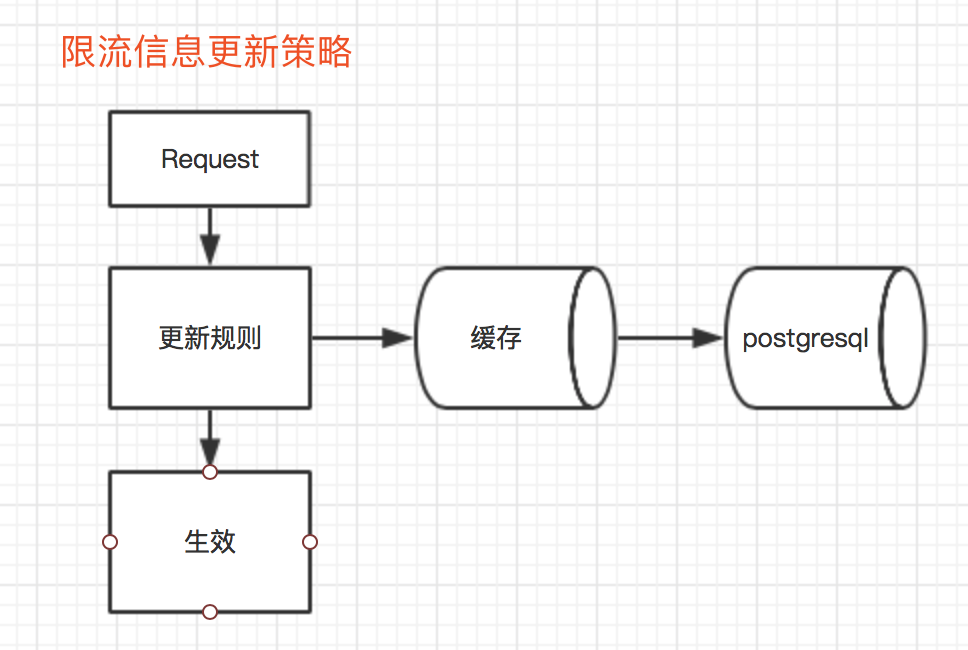

# 细粒度(url)网关限流实现方案
&#8195;&#8195;本技术方案是在[rate-limit](https://github.com/vibrantbyte/often-script/blob/master/lua/docs/rate-limit.md)基础上对限流更细粒度的限制，将原来对于服务的限制细化到url级别，具体实现使用令牌桶的方式来实现限流。此需求来源于内部团队，对于部分流量较大接口的后端接口的保护策略需求。但是又不能将所有的接口进行统一的限制。  
&#8195;&#8195;还有一个需要提到的地方时是url白名单功能，既然已经能够通过url匹配到了限流信息，那么当流量为0的时候此接口处于关闭状态，不能响应服务。所以流量分为三种情况：-1 = 无限流量，0 = 接口关闭，>0 = 接口限流。

> 实现主要思路是根据梳理需求加以整理而来，具体如下：
1. 通配符URL的支持，思路：lua的url模式匹配库、string模式匹配、ant apache的antpathmatcher(自研)；
2. 规则缓存及持久化支持，具体为：直接内存、redis缓存、postgresql；
3. 令牌桶限流算法实现，策略支持：local、cluster、redis；

* 处理流程：

* 数据更新流程:  


描述：当请求打到nginx上的时候，lua通过url匹配库获取缓存中对应的限流信息，根据限流信息向token bucket中放置token，放置token的速度根据限流配置信息中的速度来投放，然后去领取token，如果token bucket中还有可用的token，那么该接口放行，如果没有可用的token了，接口关闭；

## 一、通配符URL支持
**最初想法是想使用location的解析器来实现通配符URL，毕竟c实现的性能最好，但是查询资料和翻阅源码，并没有找到为提供外部调用的接口，location的模式匹配url使用的是三叉树来实现的。读写效率非常高，但是我们不能使用。只能另辟蹊径。**

### 1. antPathMacher通配规则
参考：
* [Ant Path匹配模式](http://ant.apache.org/manual/api/org/apache/tools/ant/types/Path.html)  
* [ch215-url-matcher 匹配标准](http://www.mossle.com/docs/auth/html/ch215-url-matcher.html)
~~~
    AntPathMatcher是spring框架的一个工具类，位置在org.springframework.util包中，是对 Ant Path匹配原则的升级。此规则出自于Ant Apache工具的一部分。根据调研没有发现对于该规则的其他语言实现。如果想要兼容spring框架的URL模式匹配规则，需要自研。
~~~

当然我们可以先看一下它的规则具体是什么，是否存在自研价值； 
> Table Ant Wildcard Characters

| Wildcard | Description |
| :-- | :--|
|?|匹配任何单字符|
|*|匹配0或者任意数量的字符|
|**|匹配0或者更多的目录|

> Table Example Ant-Style Path Patterns

| Path | Description |
| :-- | :-- |
| /app/*.x | 匹配(Matches)所有在app路径下的.x文件 |
| /app/p?ttern | 匹配(Matches) /app/pattern 和 /app/pXttern,但是不包括/app/pttern |
| /**/example | 匹配(Matches) /app/example, /app/foo/example, 和 /example |
| /app/**/dir/file. | 匹配(Matches) /app/dir/file.jsp, /app/foo/dir/file.html,/app/foo/bar/dir/file.pdf, 和 /app/dir/file.java	 |
| /**/*.jsp | 匹配(Matches)任何的.jsp 文件 |

### 2. lua版本URL模式匹配库
参考：
* [LpegTutorial](http://lua-users.org/wiki/LpegTutorial)
* [Lpeg解析用法](https://www.jianshu.com/p/e8e1c5abfdbb)
~~~
    LPEG是一个供lua使用的基于 Parsing Expression Grammars 的模式匹配库。虽然PEG模式匹配库已经支持好多语言，功能也是非常强大。但是对于LPEG的性能问题还是需要考虑一下。主要是出自于对lua的性能优化原则：Reduce（削减）, Reuse（重用） and Recycle（回收）。  
    首先我们简单了解下LPEG的工作原理，LPeg将每个模式字符串编译成一个内部的用于匹配字符串的小程序，编辑过程开发大于匹配开销，所以LPeg将编译结果缓存化以便重用。需要一个表，以模式字符串为键、编译后的小程序为值进行记录。  
    但是使用table来进行存储，存储结果会带来大量的存储开销，从而导致整体性能下降。所以我们可以使用若表来存储，没有使用到的值将会被回收。
~~~
> 主要模式及案例
```lua
require("lpeg")
--- 使用语法
lpeg.match (pattern, subject [, init])
--[[
lpeg.match (pattern, subject [, init])
匹配函数，尝试用给定模式去匹配目标字串。成功返回，匹配字串后的第一个字符索引，或者捕获值（如果取捕获值，由小括号取得 ）；失败返回nil
可选数字参数init，指定匹配开始索引位置；负数表示由字串向前查找
--]]

--[[
lpeg.type (value)
判断给定值是否为模式，是返回“pattern",否返回nil
--]]
print (lpeg.type(S'a')) -- pattern
print (lpeg.type(P'a')) -- pattern
print (lpeg.type('a'))  -- nil

--- 使用方法及说明
local match = lpeg.match -- match a pattern against a string
local P = lpeg.P -- match a string literally
local S = lpeg.S  -- match anything in a set 
local R = lpeg.R  -- match anything in a range
local C = lpeg.C  -- captures a match
local Ct = lpeg.Ct -- a table with all captures from the pattern
```
> lpeg.P (value) 前全匹配
~~~
按如下规则，将值转为相应的模式
1、如果参数为模式，返回输入模式
2、如果参数为字串，返回模式，该模式匹配输入字串
3、如果参数为非负n, 返回模式，该模式匹配n个字符
4、如果参数为负n, 返回模式，该模式
5、如果参数为boolean,返回模式，该模式匹配总是成功或者失败，由参数值确定， 但匹配不消消耗输入
6、如果参数为table， 按语法进行解析
7、如果参数为function, 返回模式，等价匹配时在空字串上的捕获
~~~
```lua
print (match(P'a','aaaa'))    -- 从1开匹配，返回匹配后的位置2
print (match(P'ab','abaa'))   -- 从1开匹配，返回匹配后的位置3
print (match(P'ab','abaabz',4))  -- 从3开匹配，返回匹配后的位置3
print (match(P'ab','abaabz',3))  -- 从3开匹配，返回匹配后的位置3
```
> lpeg.S (string) 字符取交集
~~~
返回模式，该模式匹配一个字符，该字符在string集中有出现过。
lpeg.S("+-*/")匹配加减乘除符号中
~~~
```lua
print(match(S'1235','1235')) -- 2
print(match(S'1235','13')) -- 2
print(match(S'1235','16')) -- 2
print(match(S'1235','5')) -- 2
print(match(S'1235','6')) -- nil
```
> lpeg.R ({range}) 字符范围
~~~
返回模式，该模式匹配一个字符，该字符属于范围中的一个。range返回长度为2个字符，前低后高，两端包含。多个范围用逗号隔开
lpeg.R("09") 匹配任意数字, lpeg.R("az", "AZ") 匹配任意ASCII字符
~~~
```lua
print(match(R('az','AZ'),'1')) -- nil
print(match(R('az','AZ'),'A')) -- 2
print(match(R('az','AZ'),'Aa')) -- 2
print(match(R('az','AZ'),'a1')) -- 2
```
> lpeg.C (patt)
~~~
创建一个简单捕获， 获得一个PATT匹配目标字串的一个字串。
Captures
捕获
就是模式匹配结果。
LPeg提供了多种捕获, 可以产生基于匹配和这些值的组产生新值，每次捕获0个或者多个
~~~
```lua
local C = lpeg.C
print (match(C(P'a'^-5), "aaaacccc"))  -- aaaa
print (match(C(P'a'^-5), "aaaaaaccccc")) -- aaaaa
print (match(C(P'd'^-5), "aaaaaaccccc")) --
```
> lpeg.B(patt)
~~~
返回仅当当前位置的输入字符串前面有patt时才匹配的模式。模式patt必须只匹配具有固定长度的字符串，并且不能包含捕获。
与and谓词一样，这个模式从不消耗任何输入，而与成功或失败无关。
~~~
> lpeg.V(v)
~~~
此操作为语法创建非终结符(变量)。所创建的非终结符引用了包含在语法中的由v索引的规则。
~~~

---
> 优化过程：  
1. 使用高阶函数，定义一个通用的缓存化函数
```lua
function memoize (f)
    local mem = {} -- 缓存化表
    setmetatable(mem, {__mode = "kv"}) -- 设为弱表
    return function (x) -- ‘f'缓存化后的新版本
        local r = mem[x]
        if r == nil then --没有之前记录的结果？
            r = f(x) --调用原函数
            mem[x] = r --储存结果以备重用
        end
        return r
    end
end
```
对于任何函数f，memoize(f)返回与f相同的返回值，但是会将之缓存化。例如，我们可以重新定义loadstring为一个缓存化的版本：loadstring = memoize(loadstring)  
新函数的使用方式与老的完全相同，但是如果在加载时有很多重复的字符串，性能会得到大幅提升。  
2. 如果你的程序创建和删除太多的协程，循环利用将可能提高它的性能。现有的协程API没有直接提供重用协程的支持，但是我们可以设法绕过这一限制。对于如下协程：
```lua
co = coroutine.create(function (f)
    while f do
        f = coroutine.yield(f())
    end
end)
``` 
这个协程接受一项工作（运行一个函数），执行之，并且在完成时等待下一项工作。

### 3. lua下string.match模式匹配
参考：
* [string Patterns 模式匹配](http://www.lua.org/manual/5.1/manual.html#5.4.1)

> 规则请参考链接，下面给出一些从网上找到的例子
```lua
--获取路径
function stripfilename(filename)
         return string.match(filename, "(.+)/[^/]*%.%w+$") --*nix system
         --return string.match(filename, “(.+)\\[^\\]*%.%w+$”) — windows
 end
--获取文件名
function strippath(filename)
         return string.match(filename, ".+/([^/]*%.%w+)$") -- *nix system
         --return string.match(filename, “.+\\([^\\]*%.%w+)$”) — *nix system
 end
--去除扩展名
function stripextension(filename)
         local idx = filename:match(".+()%.%w+$")
         if(idx) then
                 return filename:sub(1, idx-1)
         else
                 return filename
         end
 end
--获取扩展名
function getextension(filename)
         return filename:match(".+%.(%w+)")
 end
 local paths = "/use/local/openresty/nginx/movies/fffff.tar.gz"
 print (stripfilename(paths))
 print (strippath(paths))
 print (stripextension(paths))
 print (getextension(paths))
```

## 二、规则缓存及持久化支持
### 1. 存储结构设计
| 字段名 | 含义 | 是否必填 | 重要性 | 备注 |
| :-- | :-- | :-- | :-- | :-- |
| id | 自增ID | 是 | 主键 | 数据主键，快速查找配置信息 |
| service | 项目名称 | 是 | 比较重要 | 数据库中使用service进行规则分组，与kong里面的service一一对应。 |
| url | 接口地址 | 是 | 重要 | url的pattern表达式或url，通过请求的URL来定位限流位置信息。 |
| method | 请求方式 | 是 | 重要 | 对url的请求方式进行限制，主要有GET、POST、PUT、DELETE等等。 |
| limit | 单位时间请求量 | 是 | 重要 | 用于限流，默认不限流，可以关闭接口 -1：不限流， 0：关闭接口，>1 具体限流值 |
| timespan | 时间段（s） | 是 | 重要 | 时间间隔，以秒为单位。比如：1 = 1s，60 = 1m，3600 = 1h |
| is_wildcard | 接口是否是模糊接口 | 是 | 比较重要 | 该URL是否是通配地址，0 否 1 是。默认为否。 通配地址实例：\zuul_home/test/{id}，/zuul_home/test/**，/zuul_home/test/?等 |
| remark | 备注 | 否 | 不重要 | 用于描述接口的功能 |
| update | 更新时间 | 否 | 不重要 | 数据更新时间 |
### 2. 缓存结构设计
> url 和 行数据缓存 （基本配置信息）
1. 如果是完全匹配去map中获取  
2. 如果是pattern匹配循环规则组。

全匹配 map 结构, service_name为kong的service。  
key：kong:rate_limit_kmp:service_name  
value: map(url,令牌桶相关信息)

| 字段名 | 含义 | 备注 |
| :-- | :-- | :-- |
| id | 自增列 | int值 |
| service | 服务名称 | 服务名称 |
| method | 请求方式 | 请求方式 |
| limit | 单位时间请求量 | 单位时间请求量 |
| timespan | 时间段 | 时间段 |

---

模式匹配 map结构 service_name为kong的service。 
key: kong:rate_limit_pattern:service_name
value: map(url,令牌桶相关信息)  
**>>遍历pattern列表，找到对应的信息<<**

| 字段名 | 含义 | 备注 |
| :-- | :-- | :-- |
| id | 自增列 | int值 |
| service | 服务名称 | 服务名称 |
| method | 请求方式 | 请求方式 |
| limit | 单位时间请求量 | 单位时间请求量 |
| timespan | 时间段 | 时间段 |

---

> 令牌桶key 和 limiter  
 service_name为kong的service。
 id 为 数据主键

key: kong:rate_limit:service_name:id  
value: integer

## 三、令牌桶算法实现具体策略
### 1. local 策略

```lua
lua_shared_dict my_limit_req_store 100m;
....

 local limit_req = require "resty.limit.req"

       local lim, err = limit_req.new("my_limit_req_store", 2, 0)
       if not lim then
           ngx.log(ngx.ERR, "failed to instantiate a resty.limit.req object: ", err)
           return ngx.exit(500)
       end

       local key = ngx.var.binary_remote_addr
       local delay, err = lim:incoming(key, true)
       if not delay then
           if err == "rejected" then
               return ngx.exit(503)
           end
           ngx.log(ngx.ERR, "failed to limit req: ", err)
           return ngx.exit(500)
       end
       
       -- 此方法返回，当前请求需要delay秒后才会被处理，和他前面对请求数
       -- 此处忽略桶中请求所需要的延时处理，让其直接返送到后端服务器，
       -- 其实这就是允许桶中请求作为突发流量 也就是令牌桶桶的原理所在
       if delay >= 0.001 then
       --    ngx.sleep(delay)
       end
```

### 2. redis 策略
```lua
-- url 匹配后

--- key
local limit = 10;
local key = "kong:rate_limit:service_name:id";
local current
current = redis.call("incr",key)
if tonumber(current) == 1 then
    redis.call("expire",key,过期时间)
end

-- value
if current != nil && current > limit then
    -- too many requests per seconds
end
```
### 3. cluster 策略

```lua
--- 具体实现参考rate-limiting

```

